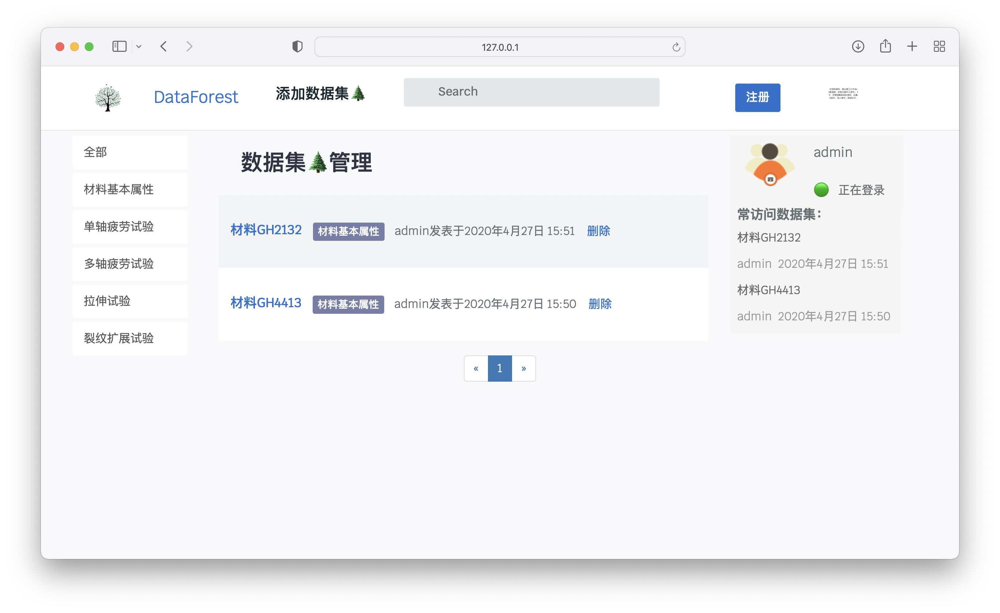
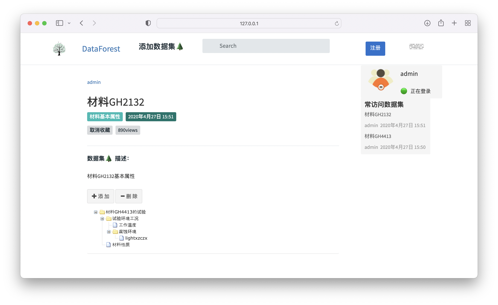
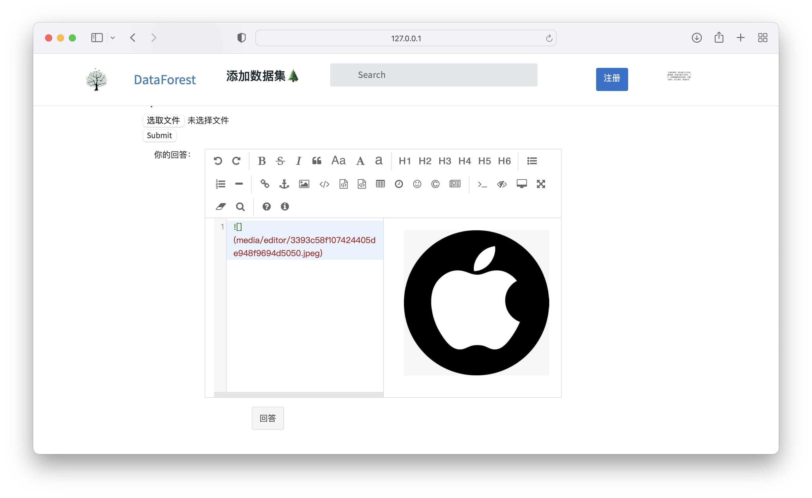
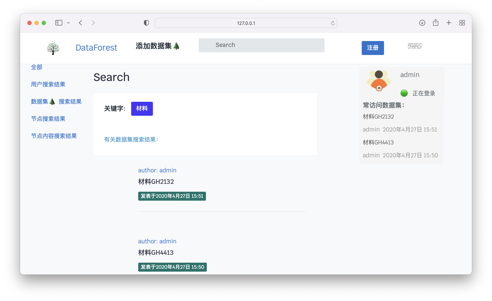

# DataForest 🌲  数据库
### It's a Database platform based on Django, zTree and some simple structure.

**使用：**

装好 python3

`cd`到 DataForest 文件夹下

`pip3 install -r requirements.txt`

`python3 manage.py runserver`

**展示**

#### 主页分类

#### 详情页

#### Markdown 书写

#### Search

**功能：** 
0. 数据库添加功能： 
    - 使用Markdown书写并提交
    - 根据创建时间对问题进行排序
1. zTree文档管理功能：
    - zTree 文档管理工具
    - 可以利用Markdown书写节点内容
    - 上传文件至节点
2. 分区功能：
    - 可以分类展示不同类型的实验数据
3. 搜索功能：
    - 通过输入关键字对数据文档、数据内容、文件进行搜索
    - 搜索结果中数据文档、数据内容、文件按照发布日期等进行排序
    - 可以选择搜索结果的类别
4. 用户注册功能：
    - 注册用户
    - 上传头像
    - 修改个人资料
  
**需要安装的拓展包：**
0. django('version: 2.2.3')
1. Markdown(`version: 3.2.1`) # 用于前端显示
2. Pillow(`version: 7.1.2`)
3. django-notifications-hq(`version: 1.6.0`)
4. django-mdeditor  # 用于后台编辑

**运行方式：**
1. 在本地下载目录
1. 配置python解释器及虚拟环境
1. 在命令行输入python manage.py runserver
1. 在网页输入网址`http://127.0.0.1:8000/`
